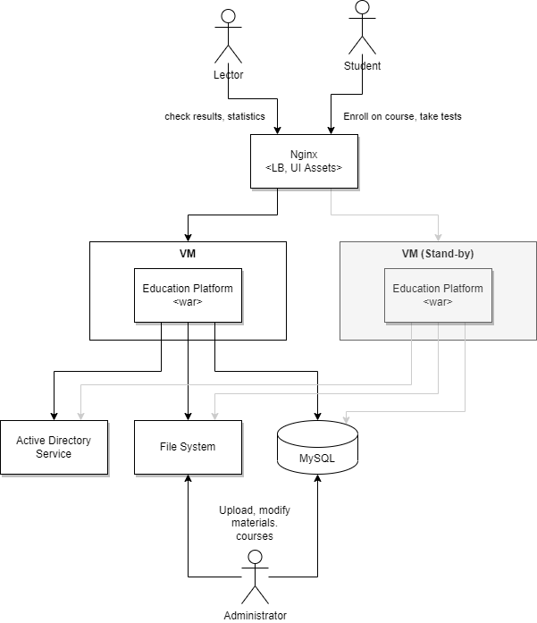

# Architetcure Styles & Patterns Practical Task

## Client

National X-City University.

## Request

The existing education platform allows our stydents students to pass our unique Computer Science cources online. Currently we have monolith system along with database and file system deployed in our private campus data center. We also have our identity management solution that allows students to sign-in with their internal accounts. New cources and materials are created manually via direct access to file system and database.
We are willing to expose our platform capabilities across the globe providing access to cources and materials for external students in a free and paid form. We also want to drastically extend number of cources and related materials (video, articles), automate  grading process of solutions submitted by students to given problems from the course. As we anticipate a lot of new end users using our platform we'd like to start platform migration to cloud, we see it as a iterative, smooth process without any business disruption. Apart from existing functionality we'd like to extend the system with new capabilities:
 - we would like to have some aggregated statistics (reporting) 
 - we want to give users recommendations based on their profile.
 - external users might have a way to login with their social network accounts. Administrator should be able to add new courses in a couple of clicks.

 ## Discovery

 Client hired external Solution Architect to come up with new proposal and migration plan. In the first place Solution Architect documented existing system.

 

 
