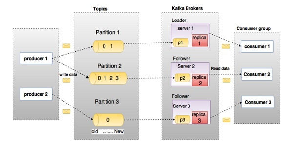

# Apache Kafka  

## Prerequisits: 

Configure Kafka cluster using docker with the following parameters:
* Number of brokers - 3 
* Number of partitions - 3
* Replication factor - 2

## Practical Task:

I. Implement a Spring Boot application with `"at least once"` producer and  `"at most once"` consumer.

II. Implement a Spring Boot application with exactly-once delivery between producer and consumer applications through the Transactional API

III. Implement a taxi application using Spring Boot. The application should consist of three components:
   1. REST service fo sending taxi coordinates and car ID.
   2. Kafka broker. 
   3. Three consumers to calculate the distance traveled by a car.
 
Messages from one vehicle must be processed `sequentially`!

## References

1. [Kafka Introduction](https://kafka.apache.org/intro)
2. [Kafka Quickstart Guide](https://kafka.apache.org/quickstart)
3. [Spring Kafka Introduction](https://docs.spring.io/spring-kafka/reference/html/#introduction)
4. [Learn Apache Kafka for Beginners](https://www.linkedin.com/learning/learn-apache-kafka-for-beginners)

# RabbitMQ

## Prerequisits: 

Download and install classic RabbitMQ.

## Practical Task:
I. Implement a Spring Boot application for sending notifications to customers about the receipt of goods based on the following architecture:

## References

1. [RabbitMQ Documentation](https://www.rabbitmq.com/documentation.html)
2. [Spring. Messaging with RabbitMQ](https://spring.io/guides/gs/messaging-rabbitmq/)
3. [Learning RabbitMQ](https://www.linkedin.com/learning/learning-rabbitmq)

# ActiveMQ

## Prerequisits: 

Download and install classic ActiveMQ.

## Practical Task:

I. Implement publish/subscribe interaction between two applications. Check durable vs non durable subscription.

II. Implement request-reply interaction between two applications using a temporary queue in ActiveMQ.

III. Implement subscriber scaling, i.e. create n subscribers to a topic with the same ClientID (see Virtual Topics in ActiveMQ)

